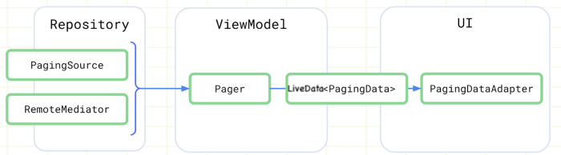

# RickAndMortyApiFlow
# Android Architecture: Paggin 3, MVVM, Flow, Retrofit2, Dagger-Hilt

# App RickAndMortyApiFlow
<div align="justify">

[The Rick and Morty API](https://rickandmortyapi.com/)<br></p>

</div>

# Bom uma breve introdução de tudo que foi usado no projeto (Todo esse resumo foi tira de artigos que deixo sempre no final de cada resumo)

## O que é a biblioteca de paginação (Paging 3)
<div align="justify">
A biblioteca Paging ajuda você a carregar e exibir páginas de dados de um conjunto de dados maior do armazenamento local 
ou pela rede. Essa abordagem permite que seu aplicativo use a largura de banda da rede e os recursos do sistema com mais 
eficiência.<br></p>

### Arquitetura da Biblioteca


* Camada do repositório<br></p>
Um PagingSourceobjeto pode carregar dados de qualquer fonte única, incluindo fontes de rede e bancos de dados locais.<br></p>
Um RemoteMediatorobjeto manipula a paginação de uma fonte de dados em camadas, como uma fonte de dados de rede com um cache de banco de dados local.<br></p>

* Camada ViewModel<br></p>
 O Pagercomponente fornece uma API pública para construção de instâncias PagingDataque são expostas em fluxos reativos, com base em um PagingSourceobjeto e um PagingConfigobjeto de configuração.<br></p>
Um PagingDataobjeto é um contêiner para um instantâneo de dados paginados. Ele consulta um PagingSourceobjeto e armazena o resultado.<br></p>

* Camada de interface do usuário<br></p>
O componente primário da biblioteca de paginação na camada de interface do usuário é PagingDataAdapterum RecyclerViewadaptador que manipula dados paginados.<br></p>
Saiba mais sobre a biblioteca [Paging3](https://annchar.medium.com/android-paging-3-library-with-offset-and-limit-parameters-mvvm-livedata-and-coroutine-part1-5f85aa4fd29a)
</div>


## O que é a MVVM (Model-View-ViewModel)
<div align="justify">

MVVM é um padrão de projeto baseado em UI, ele é uma aplicação do MVP, que é uma derivação do MVC. Estes padrões de projeto (MVC, MVP e MVVM) procuram atingir os mesmos objetivos mas com soluções diferentes.<br></p>

### Objetivos
* Rich UI (interface rica)
* Testabilidade
* Modularidade
* Facilidade de manutenção
* Flexibilidade


### História do MVVM
MVVM foi introduzido em 2005 por John Gossman, na Microsoft, para ser usado com WPF (Windows Presentation Foundation) sendo uma aplicação concreta do MVP, descrito por Martin Fowler.<br></p>
O MVVM como implementação do MVP usa varias capacidades específicas disponíveis em WPF, Silverlight, Windows Universal Platform (UWP). Algumas implementações do MVVM tais como MvvmCross, MVVM Light disponibilizam esse padrão para Xamarin.android e Xamarin.iOS.<br></p>

### MVVM Princípios
MVVM tem alguns princípios que quando seguidos, facilitam a sua implementação.<br></p>

Princípio da Simplicidade: Cada View deveria ter uma única ViewModel e uma ViewModel deveria fornecer serviços para uma única View.<br></p>

Princípio da Blendability: Quando usado em plataforma Windows, deveria suportar o uso da ferramenta Blend (instalada junto com o Visual Studio).<br></p>

Princípio de Designability: A ViewModel deveria disponibilizar dados para ser utilizados em Design Time.<br></p>

Princípio da Testabilidade: As ViewModels e Models devem permitir/facilitar o uso de testes.<br></p>

### Arquitetura MVVM


* View<br></p>
A View é a interface com o usuário, uma tela, uma janela ou uma interface de entrada e saída qualquer. 
A ligação entre a View e a ViewModel ocorre através da propriedade DataContext da View. 
DataContext armazena uma referência para a ViewModel e assim através de data binding e commands a View se comunica com a ViewModel e tem acesso as atividades e dados fornecidos pela ViewModel. 
A View não executa nenhuma operação no sistema. Ela simplesmente apresenta informações ao usuário e responde à essa interação de forma visual. 
A View apenas interage com o usuário. 
Por exemplo, numa caixa de texto, o usuário consegue ler ou escrever dados, mas não é tarefa da View validar esses dados ou envia-los para uma base de dados.

* ViewModel<br></p>
ViewModel é uma classe não visual, que dá vida a uma View. 
A ViewModel não tem nenhuma ligação com a View, nenhuma referência, ela simplesmente fornece os dados e executa ações que a View necessita. 
A ViewModel se comunica com a View por expor suas propriedades e através de bindings “notifica” a View sobre alguma alteração nos dados, ou atualiza os dados quando modificados pela View. 
Uma ViewModel implementa algumas interfaces, tais como: INotifyPropertyChanged, INotifyCollectionChanged, ICommand, etc. 
A ViewModel se conecta diretamente com o Model. Tendo acesso as propriedades e funcionalidades disponibilizadas pelo Model. 

* Model<br></p>
O Model é a classe que contém os dados da sua aplicação, como empregado, produto, cliente, etc…
O Model define uma série de propriedades e métodos. Você pode criar um Modeldo zero ou obte-lo através de um ORM tipo Entity Framework ou ainda através de um servidor REST convertido do JSON, por exemplo.

* Data Binding<br></p>
Data Binding é o meio de comunicação entre uma View e uma ViewModel.
Se a associação, binding, possui as configurações corretas e os dados fornecem as notificações adequadas, então, quando os dados mudam de valor, os elementos visuais que estão vinculados aos dados refletem alterações automaticamente e vice versa.

Geralmente o Model também é responsável pela validação dos dados.

Saiba mais sobre [MVVM](https://medium.com/netcoders/introdu%C3%A7%C3%A3o-ao-mvvm-model-view-viewmodel-cb5920b4ca58)
</div>

## Introdução ao Dagger Hilt
<div align="justify">
 
 * Dagger<br></p>
 
 O Dagger foi criado em 2010, pela Square, e trouxe muitas novidades, como scoped bindings, multi-bindings, components, sub-components, qualifiers, dentre outras funcionalidades. Em sua primeira versão, o framework era bem promissor e chegou a ser utilizado bastante na comunidade e em projetos de grande porte. Porém, a sua grande desvantagem era a utilização de reflection para realizar a resolução de dependências em tempo de execução (apesar de já utilizar geração de código, porém em menor quantidade), o que poderia comprometer drasticamente a performance do app.<br></p>
 Em 2015, a Square passou o bastão para a Google, que implementou várias novidades e melhorias na versão 2.0. A nova versão utilizava annotation processing, na qual agora as classes eram geradas em tempo de compilação, o que de certa forma melhorou a performance no app, porém trouxe uma demora maior no tempo de build, por conta da geração das classes. Conforme o projeto escalava, era muito comum um processo de build durar vàrios minutos para finalizar.<br></p>
 Com o passar dos anos, Dagger foi se tornando uma das mais temidas e ao mesmo tempo desafiantes bibliotecas em Android, principalmente por possuir uma curva de aprendizagem alta, conceitos complexos para serem compreendidos por desenvolvedores iniciantes (ou pelos mais experientes às vezes). Além disso, com o advento do Kotlin, eram necessários alguns workarounds para fazer com que a engine funcionasse corretamente no projeto.<br></p>
 
 * Dagger-Android<br></p>
 O Dagger, em sua versão vanilla, foi concebido para ser executado em qualquer ambiente que execute uma JVM, como aplicações standalone, web e inclusive em Android, onde ficou mais famoso. Porém, em Android o contexto é um pouco diferente e muito mais desafiador, por vários motivos. Por exemplo, os componentes Android como Activity, Service, Fragment não são instanciados manualmente, mas sim pelo próprio framework, tornando um processo mais delicado para injeção de dependência.<br></p>
 Na tentativa de sanar esse vão na plataforma, a Google desenvolveu o Dagger-Android, uma extensão que tinha o propósito de tornar o framework mais compatível e aderente ao ecossistema do Android. Foram criados componentes para diminuir a quantidade de boilerplate, como era o caso da anotação @ContributesAndroidInjector, DaggerApplication, AndroidInjection, dentre outras. Porém, mesmo assim, acabou gerando uma complexidade maior pois agora o desenvolvedor necessitaria dominar tanto Dagger quanto Dagger-Android em seus projetos.
 
 ### O que é o Hilt ?<br></p>
 Hilt em Inglês significa “punho”, a parte de uma adaga ou espada que deve-se segurar para que não se corte ao manuseá-las. Metaforicamente contextualizando para desenvolvimento Android, é o que precisamos utilizar para não nos “ferirmos” (nos conceitos, setup, tempo de build, testes) ao utilizar o Dagger.<br></p>
 Construído com base no Dagger, o Hilt é a nova biblioteca que a Google lançou recentemente para injeção de dependência, o mais novo integrante do Jetpack. Ao contrário do seu ancestral, ele é simples, de fácil configuração e requer muito menos boilerplate para ser configurado dentro do projeto.
 
 * Configurando o Hilt<br></p>
 Configurar o Hilt, basicamente, exige apenas 4 passos:<br></p>
* Adicionar o Hilt Android Gradle Plugin<br></p>
Para configurar o Hilt no projeto, primeiramente é necessário adicionar o hilt-android-gradle-plugin no build.gradle do projeto:<br></p>
 ```
 dependencies {
    classpath 'com.android.tools.build:gradle:4.0.0'
    classpath "org.jetbrains.kotlin:kotlin-gradle-plugin:$kotlin_version"
    classpath "com.google.dagger:hilt-android-gradle-plugin:$hilt_version"
}
   ``` 
  Apesar do plugin não ser obrigatório para que o Hilt funcione, ele permite que as anotações sejam utilizadas sem a necessidade de estender classes Hilt_* que serão geradas via annotation processing. Sem a utilização do plugin, é necessário definir as classes da seguinte maneira:<br></p>
 ```
  @HiltAndroidApp
  class MyApplication: Hilt_Application()
  
   ``` 
  Com o plugin, basta adicionar a anotação @HiltAndroidApp e estender Application normalmente: 
   ```
 @HiltAndroidApp
class MyApplication: Application()
  
   ``` 
   O plugin realiza uma transformação no bytecode gerado e adiciona automaticamente a extensão à classe Hilt_Application para você, evitando mais boilerplate.<br></p>
   Depois, importe o plugin adicionando o seguinte comando no build.gradle da aplicação:
   ```
    apply plugin: 'dagger.hilt.android.plugin'
  
   ``` 

* Importar as dependências do Hilt<br></p>
O segundo e último passo é adicionar os comandos para importar as dependências do Hilt:
```
   implementation 'com.google.dagger:hilt-android:2.28-alpha'
kapt 'com.google.dagger:hilt-android-compiler:2.28-alpha'
  
   ``` 
   Se o seu projeto utiliza Java, troque o comando kapt por annotationProcessor:
```
annotationProcessor 'com.google.dagger:hilt-android-compiler:2.28-alpha'
  
   ``` 
Depois disso, basta sincronizar o seu projeto e as anotações e as classes do Hilt já estarão disponíveis para serem utilizadas.<br></p>
* Adicionar uma Hilt Android Application<br></p>
Para permitir que o Hilt gere os componentes e injete as classes, é necessário anotar a Application do seu projeto com a anotação @HiltAndroidApp:
 ```
    @HiltAndroidApp
class MyApplication: Application()
  
   ``` 
   Com Dagger puro, seria necessário adicionar uma chamada para inicializar o componente DaggerApplicationComponent e realizar a injeção manualmente:
  ```
  class MyApplication: Application() {
  
    private lateinit var appComponent: ApplicationComponent
  
    @Inject lateinit var logger: AuditLogger
  
    override fun onCreate(){
        super.onCreate()
        appComponent = DaggerApplicationComponent().create()
        appComponent.inject(this)
    }
}
  
   ``` 
   Agora imagine que você deseja registrar logs para fins de auditoria. Para injetarmos dentro da Application, basta adicionar o @Inject no construtor da classe:
```
   class AuditLogger @Inject constructor() {
    fun log(message: String) {
        Log.i(message)
    }
}
  
   ```   
   E injetá-la também usando a anotação @Inject:
```
@HiltAndroidApp
class MyApplication: Application() {
  
    @Inject lateinit var logger: AuditLogger
}
   ``` 
   Aqui vale mencionar algo importante: como não temos uma inicialização explícita do componente usando Hilt, a partir de qual ponto que é possível utilizar o objeto e garantir que terá uma instância provida para ele? A resposta é: depois da chamada do método onCreate() da classe mãe, dessa maneira:
```
override fun onCreate() { 
    super.onCreate() // Injection takes place here
    logger.log("Initializing component")
}
   ``` 
   Porém, esse trecho iria gerar uma exceção ao tentar acessar a propriedade logger:
```
override fun onCreate() {
    logger.log("Initializing component") // NPE will be raised here!
    super.onCreate()
}
   ``` 

* Adicionar @AndroidEntryPoint<br></p>
O Hilt trouxe um conceito novo de Entry Points, que pode ser entendido como a fronteira entre códigos que poderão ser gerenciado pelo Dagger, isto é, o local onde o as classes poderão ser injetadas. O Hilt já define a anotação @AndroidEntryPoint por padrão. Ela pode ser utilizada em componentes Android, como Activity, Service, Fragment, etc. Suponha que precise chamar o mesmo logger do exemplo anterior na MainActivity. O código ficaria da seguinte maneira:
```
@AndroidEntryPoint
class MainActivity: AppCompatActivity() {
    
    @Inject lateinit var logger: AuditLogger
  
    override fun onCreate(savedInstanceState: Bundle?){
        super.onCreate(savedInstanceState)
        setContentView(R.layout.activity_main)
        logger.log("User initialized main screen")
    }
}
   ``` 
* Hilt Modules<br></p>
 Agora suponha que você precise adicionar uma nova dependência via módulo do Dagger que precise ser utilizada na Activity do projeto, porém com provisão via módulo Dagger:
```
@InstallIn(ActivityComponent::class)
@Module
object AuditModule {
    
    @Provides
    fun provideAnotherLogger(param: Param) = AnotherLogger(param)
}
   ```
   A anotação @InstallIn é utilizada para indicar ao Hilt que este módulo será adicionado no componente padrão ActivityComponent. Essa anotação é obrigatória para que um módulo seja interpretado corretamente pelo Hilt.
   * Hilt Components<br></p>
 No trecho de código acima, como que o Hilt soube injetar a classe AnotherLogger? Qual a mágica por trás de tudo isso? O grande segredo do truque é que o Hilt possui vários componentes e escopos já definidos por padrão para serem utilizados pelos componentes Android como Activity, Fragment, Service, ViewModels, Views, sem a necessidade de criação de vários components e sub-components exigido pelo Dagger. Na imagem a seguir, é possível visualizar a hierarquia de componente do Hilt.<br></p>
 <br></p>
 Na imagem acima, cada component possui um escopo associado. Isso significa que, quando uma instância está sendo provida dentro de um determinado component, ele poderá ser injetado se ele tiver um escopo compatível com aquele componente.<br></p>
 No exemplo, a classe AnotherLogger está sendo fornecida dentro do módulo AuditModule que possui o escopo @ActivityScoped. Além disso, um component em um nível mais baixo da árvore herda o escopo de seu ancestral, indicado pela seta na imagem. Contextualizando, a classe AnotherLogger pode ser utilizada tanto no escopo @Singleton, da ApplicationComponent, quanto do escopo @ActivityScoped, da ActivityComponent. Ou um ViewComponent, pode ser utilizado tanto no escopo @ViewScoped quanto @ActivityScoped.

 Saiba mais sobre [DaggerHilt](https://medium.com/android-dev-br/hilt-series-introdu%C3%A7%C3%A3o-ao-dagger-hilt-50faa1b3a194)
 </div>
 
